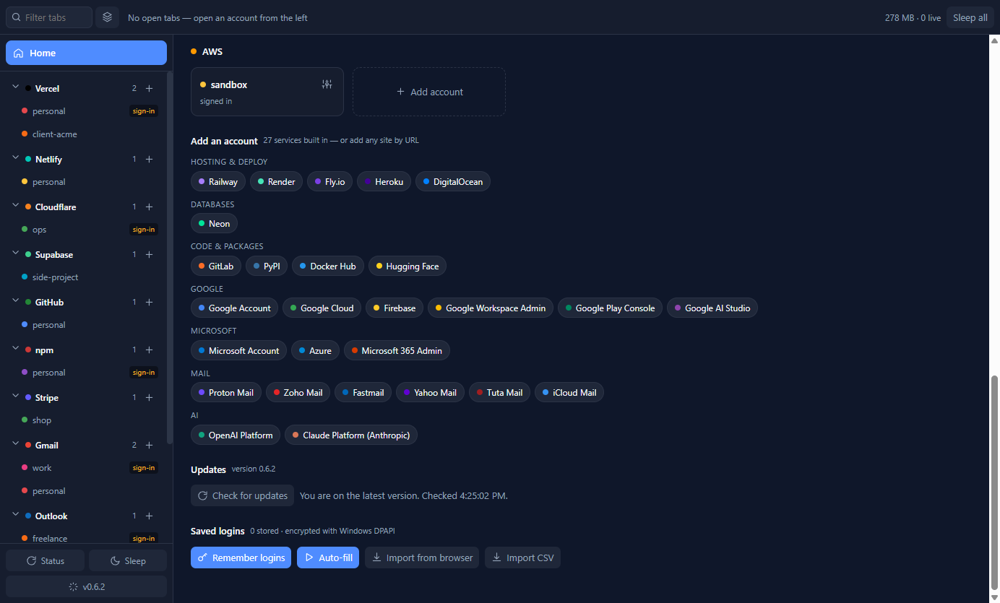
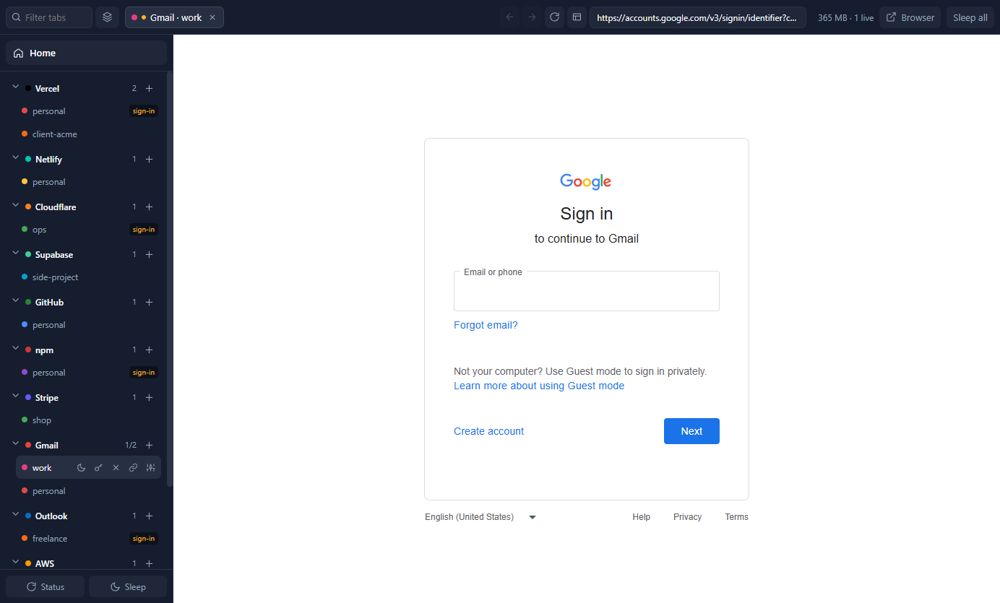

# My Provider Dash Manager

**One desktop app for every account you own.** Keep several Google, Microsoft, AWS, Vercel, Netlify,
Cloudflare, Supabase, GitHub, npm, Stripe, Gmail, Outlook and Proton Mail accounts (37 services built
in, any site by URL) signed in at the same time, each in a fully isolated session, and switch between
them instantly — the way a browser handles tabs, but built around *accounts* instead of pages.

<sub>Windows desktop app · Electron 43 · local-first · no telemetry, no account, no server ·
source-available licence: free for personal and commercial use</sub>


Further down Home: the **Add an account** picker with every built-in service you are not using yet
(37 in total, or add any site by URL), the **Updates** panel with the installed version, and the
saved-login controls. Install with `npx my-provider-dash-manager` or straight from
[Releases](https://github.com/FiredMosquito831/my-provider-dash-manager/releases) — see [Install](#install).





<sub>Screenshots use a demo profile with placeholder account names.</sub>

---

## Install

**Fastest — from the command line** (needs Node.js 18+):

```bash
npx my-provider-dash-manager
```

That downloads the newest installer from GitHub, verifies it is a real Windows executable, runs it,
and launches the app. Run the same command again later to update.

**Or download the installer** from
[Releases](https://github.com/FiredMosquito831/my-provider-dash-manager/releases) and run it.

The installer is not code-signed yet, so SmartScreen shows a warning the first time: choose
**More info → Run anyway**. The app installs per user under `%LOCALAPPDATA%\Programs` and creates
Start Menu and Desktop shortcuts. Your accounts, sessions and saved logins live in
`%APPDATA%\multi-acc-manager` and survive updates and reinstalls.

### Updating

Three ways, all ending in the same place:

- **Inside the app.** The version is always shown bottom-left in the rail. When a newer release
  exists it turns into an **Update x.y.z** button; click it to open the Updates panel on Home, which
  shows the release notes and offers **Download** and **Restart & install** with progress. The app
  checks quietly on startup and once an hour after that. Nothing is downloaded or installed until you
  press the button.
- **From the command line.** `npx my-provider-dash-manager` (or `mpdm update` if installed globally)
  installs the newest release over the current one. Close the app first, or the running copy keeps
  showing the old version until you restart it.
- **From the release page.** Run the newest installer; it upgrades in place.

The repository is public, so updates need no token or account.

### The CLI

The npm package is a small lifecycle CLI. Install it globally with `npm i -g my-provider-dash-manager`
and it is also available as `mpdm`:

| Command | What it does |
|---|---|
| `my-provider-dash-manager` | Install or update to the newest release, then launch |
| `… install` / `… update` | Install or update only |
| `… start` | Launch the installed app |
| `… status` | Installed version vs latest, plus where the app and your data live |
| `… where` | Print the install and data paths |
| `… uninstall` | Run the uninstaller (accounts and sessions are kept) |

Flags: `--silent` (no wizard), `--download-only`, `--force`, `--version`, `--help`.
From a checkout of this repository the equivalent is `npm run install:latest`.

### Run from source

```bash
npm install
npm start
```

---

## Why it exists

Every provider assumes you have exactly one identity. The moment you have a personal account and a
client account on the same service, the browser fights you:

| The usual pain | What this app does |
|---|---|
| Signing out of one account to reach another | Every account stays signed in, in its own storage partition |
| Juggling browser profiles, one window each | One window: providers on the left, open accounts as tabs on top |
| "Which account am I actually in right now?" | Every tab and rail row is colour-coded and labelled by account |
| Losing your workspace on restart | The open-tab set is remembered and restored |
| Re-typing passwords for the fifth account | Logins are captured per account and refilled automatically |
| Ads and blinding white dashboards | Built-in ad-blocking and dark mode, no extensions required |

It is not a browser and not a scraper. It is a **container for identities**: real dashboards, real
sessions, one place.

---

## Using it

1. **Add an account.** Click **Add account** at the bottom of the rail (or the `+` next to a provider
   you already use), pick the service from the searchable picker, name the account, then choose
   *Log in* or *Create a new account*. The service's real sign-in page opens inside that account's own
   isolated session.
2. **Sign in normally.** Google services sign in directly. On other sites use email/password or
   GitHub rather than "Continue with Google", which Google blocks inside embedded browsers; the
   **Browser** button finishes any stubborn flow in your system browser.
3. **Switch accounts** by clicking a tab or a rail row. Everything stays signed in.
4. **Browse.** While a tab is open the strip shows back, forward, reload, a back-to-dashboard button
   and an address bar. Type any address and press Enter to open it inside that account's session.
5. **Connect a token** (optional) via the link icon on an account to light up its status card.
6. **Import passwords** (optional) from Home → *Import from browser* or *Import CSV*.

Keyboard: `Ctrl+W` sleep tab · `Ctrl+Shift+W` sleep all · `Ctrl+Tab` cycle · `Ctrl+1…9` jump ·
`Esc` Home · `Alt+Left` / `Alt+Right` back / forward · `Ctrl+R` or `F5` reload · `Alt+Home` dashboard
· `Ctrl+L` address bar.

---

## Features

### Accounts and sessions
- **Unlimited accounts per service.** Each account gets its own Chromium storage partition — separate
  cookies, localStorage, IndexedDB and cache. Accounts can never see each other's session.
- **Sessions persist across restarts.** Sign in once; you stay signed in (verified by an automated
  restart test that counts real cookies after relaunch).
- **Instant switching.** Active tabs stay warm, so switching is a visibility toggle, not a reload.
- **Warm-tab limit with sleeping.** Each live dashboard costs roughly 125 MB, so the app keeps a
  configurable number warm (default 5) and sleeps the rest. Slept tabs stay in the strip and resume on
  click. Measured: 5 tabs ≈ 1.0 GB, 10 ≈ 1.6 GB, all slept ≈ 0.35 GB (private memory, the figure Task
  Manager reports).
- **Tab session memory.** The set of open tabs is saved and restored on the next launch: recent ones
  come back warm, the rest asleep, and you land on Home.
- **Per-account proxy** (optional) with proper connection flushing.

### Layout and browsing
- **Left rail — your identities.** Providers you use, accounts nested underneath, each with hover
  actions: open, sleep, close, fill login, connect a token, manage. Collapse any provider. The
  installed version (or an update button) sits at the bottom.
- **Top bar — open tabs only,** with a filter box and group-by-provider with collapsible groups.
- **Home** is always one click (or `Esc`) away: every account as a card with live status, the service
  picker, the Updates panel and saved-login settings.
- **Browser controls** while a tab is open: back, forward, reload/stop, back-to-dashboard and an
  editable address bar. Navigation stays inside that account's session and accepts http/https only.

### Built-in services
Thirty-seven services ship ready to use, grouped by category. The rail and Home show only the ones
you have accounts on; everything else is one click away in the **Add account** picker.

| Category | Services |
|---|---|
| Hosting & deploy | Vercel, Netlify, Cloudflare, Railway, Render, Fly.io, Heroku, DigitalOcean |
| Databases | Supabase, Neon |
| Code & packages | GitHub, GitLab, npm, PyPI, Docker Hub, Hugging Face |
| Payments | Stripe |
| Google | Google Account, Gmail, Google Cloud, Firebase, Google Workspace Admin, Google Play Console, Google AI Studio |
| Microsoft | Microsoft Account, Outlook, Azure, Microsoft 365 Admin |
| Mail | Proton Mail, Zoho Mail, Fastmail, Yahoo Mail, Tuta Mail, iCloud Mail |
| Cloud | AWS |
| AI | OpenAI Platform, Claude Platform (Anthropic) |

Every login page is verified to load inside an isolated partition, landing on a host the credential
guard trusts (`npm run smoke:services`). Google sign-in was verified against Google's own flow and
works in the app. Anything else can be added by URL or as a plugin.

### Saved logins
- **Remembers logins you type** inside an account tab, bound to *that* account, so two accounts on the
  same service refill with different credentials.
- **Auto-fills sign-in pages** when it recognises one (toggleable), plus a manual fill action.
- **Imports existing passwords** from installed Chromium browsers (Chrome, Edge, Brave, Vivaldi,
  Opera) or from a CSV exported by any browser, including Firefox.
- Encrypted at rest with Windows DPAPI. Passwords never reach the app's own UI process.
- **Origin-bound**: a login is tied to the account *and* the service's own domains. A password typed on
  another site reached from that tab (an OAuth hand-off, a look-alike page) is never captured as that
  account's login, and a saved password is never filled into a page outside the service's domains.

### API status
Paste a read-only API token into an account and its Home card shows live status: project, app,
repository or package counts and names for every built-in developer service except PyPI (whose tokens
are upload-only), latest deploy state on Vercel, account name plus charges/payouts state on Stripe.
The token field says which credential each service expects. Tokens are validated before being stored,
encrypted with DPAPI, revocable in one click, and never leave the main process.

### Updates
- Version always visible in the rail; an **Update** button appears when a newer release exists.
- Updates panel on Home: installed vs latest, release notes, Check / Download / Restart & install with
  progress. Nothing installs itself.
- Startup and hourly checks against the public release feed.

### Content
- **Ad-blocking** driven by EasyList (~52,000 blocked hosts plus generic cosmetic rules, refreshed
  weekly), applied per account partition. Main-frame navigation and sign-in infrastructure are never
  blocked.
- **Dark mode**: sites that support `prefers-color-scheme` go dark natively, and an optional
  force-dark inversion covers the ones that don't.

### Extensibility
- **Add any service by URL** — it gets its own rail row and isolated per-account sessions.
- **Service plugins**: drop a small JSON manifest into `plugins/` (or install it from the UI) to
  define a service and, optionally, how to read its API for status cards.

### Multiple accounts and provider terms
The app surfaces each provider's stance instead of hiding it. GitHub and Railway allow one account per
person and the rail says so — use their organisations and workspaces instead. Vercel, Netlify,
Supabase, Cloudflare, Heroku and DigitalOcean tolerate separate accounts but watch for abuse; the
registries, GitLab, Fly.io, Neon, Google, Microsoft and the mail providers treat extra accounts as
ordinary; Stripe expects one per business. Account creation is always manual and guided; nothing is
ever automated, because automated signup violates several providers' acceptable-use policies.

---

## How it works

Each account is a `persist:<service>__<account>` Chromium partition rendered in its own
`WebContentsView`. The app window composes those views beside a native rail and tab strip, so the
chrome is always reachable. Account pages run sandboxed with context isolation, deny-by-default
permissions, and an isolated-world preload that handles login capture and filling without exposing
anything to the page.

State lives in `%APPDATA%\multi-acc-manager`: `accounts.json` (the registry), `session.json` (open
tabs), `settings.json`, `services.json` (custom services), `plugins/`, plus DPAPI-encrypted
`tokens.json` and `credentials.json`.

### Security posture, honestly

Cookies, tokens and saved passwords are encrypted at rest with Windows DPAPI, which protects against
another user on the machine, a stolen disk, and casual copying. It does **not** protect against
malware running as you — no desktop app can, which is why the app never masks device identity and
keeps API tokens scoped and revocable. Saved logins are additionally bound to the service's own
origins, so they cannot be captured from, or filled into, an unrelated site. The address bar accepts
http/https only. Nothing syncs anywhere: there is no server, no account and no telemetry.

---

## Development

```bash
npm start              # run the app
npm run smoke          # sessions, registry, partitions, tab navigation (12 checks)
npm run smoke:restore  # sessions survive a restart (real cookies)
npm run smoke:tokens   # DPAPI round-trip + live fake-token rejection per provider (15)
npm run smoke:creds    # import, per-account recall, encryption at rest (7)
npm run smoke:autofill # real page: form detection, fill, capture, origin guard (10)
npm run smoke:updates  # version comparison + real release-feed check (8)
npm run smoke:services # every built-in login page loads inside an isolated partition (42)
npm run capture        # screenshot the running shell (--capture-out, --capture-open svc::id, --capture-js)
npm run spike          # memory benchmark
npm run dist           # build the Windows installer locally
npm run install:latest # fetch and run the latest released installer
npm start -- --print-paths            # show the app name, version and data folder
npm start -- --open vercel::personal  # open an account on launch
```

The suite is 108 checks across seven modes. `MAM_USER_DATA=<dir>` points any command at an isolated
profile.

Releases are cut by pushing a `v*` tag: GitHub Actions checks the tag against `package.json`, builds
the NSIS installer, publishes the GitHub release with the update feed, and publishes the npm package
through npm trusted publishing (OIDC, with a provenance attestation — no tokens involved).

## Licence

Source-available, © 2026 FiredMosquito831 — see [LICENSE](LICENSE).

**Free to use, personally and commercially.** You may not modify or redistribute changed versions, or
present the work as your own. If you mention the app anywhere, credit the author and link this repo:

> My Provider Dash Manager by FiredMosquito831 —
> https://github.com/FiredMosquito831/my-provider-dash-manager
