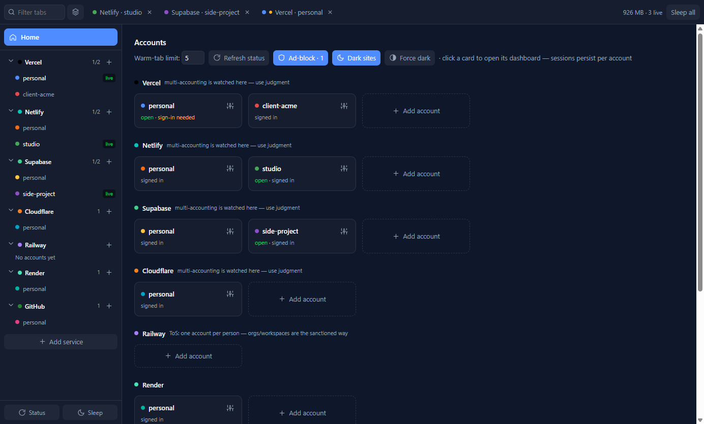
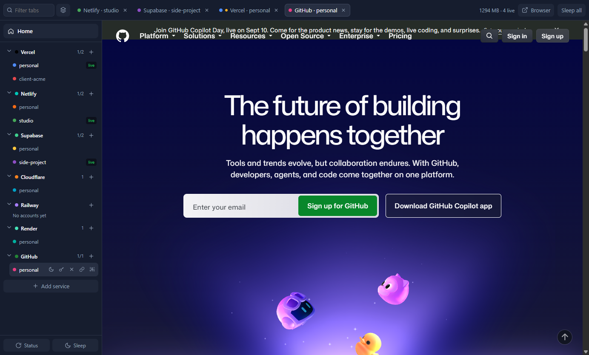
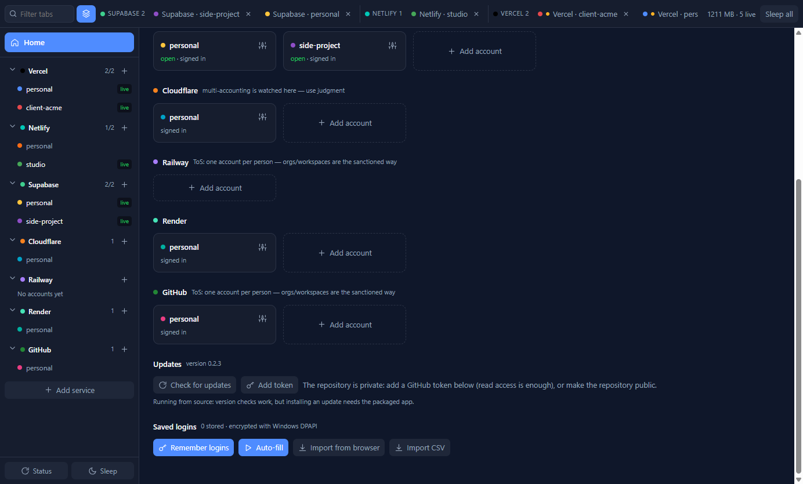

# My Provider Dash Manager

**One desktop app for every cloud account you own.** Keep several Vercel, Netlify, Supabase,
Cloudflare, Railway, Render and GitHub accounts signed in at the same time, each in a fully isolated
session, and switch between them instantly — the way a browser handles tabs, but built around
*accounts* instead of pages.

<sub>Windows desktop app · Electron 43 · local-first · no telemetry, no account, no server</sub>

---

## Install

Download the latest installer from
[Releases](https://github.com/FiredMosquito831/my-provider-dash-manager/releases) and run it.

The installer is not code-signed yet, so SmartScreen shows a warning: choose **More info → Run
anyway**.

### Updates

The Home screen has an **Updates** panel: it shows your installed version, the latest release, the
release notes, and gives you *Check for updates*, *Download*, and *Restart & install* buttons with
download progress. Nothing is downloaded or installed without you pressing the button, and the app
checks quietly on startup and once an hour after that.

While the repository is **private**, GitHub will not serve the release feed anonymously. Either make
the repository public, or paste a GitHub token (read access to this repo is enough) into the panel —
it is stored encrypted with Windows DPAPI and used only for update checks and downloads.

### Install from the command line

If you have the repository checked out, this pulls the newest release and runs its installer:

```bash
npm run install:latest                    # download + launch the installer
npm run install:latest -- --silent        # install without the wizard
npm run install:latest -- --download-only # just fetch the .exe
```

It prints the latest version and its release notes, verifies the download really is a Windows
executable before running it, and uses `GH_TOKEN` or your `gh auth login` session for the private repo.

### Run from source

```bash
npm install
npm start
```

---

## What it looks like

**Home — every service and account in one grid, with the account rail on the left.**
Each provider lists its accounts; hovering one reveals open / sleep / close / fill-login / connect-token / manage.



**A real dashboard, signed in, inside the app.** The rail and tab strip stay put, so Home is always one click away.



**The top bar is only your open tabs** — filter them, or group them by provider with collapsible sections.
Slept tabs stay in the strip (dimmed) and resume on click.


**Updates and saved logins live on Home**: installed vs latest version with release notes and an update
button, plus login remembering, auto-fill and password import.



<sub>Screenshots use a demo profile with placeholder account names.</sub>

---

## Why it exists

Every cloud provider assumes you have exactly one identity. The moment you have a personal account
and a client account on the same service, the browser fights you:

| The usual pain | What this app does |
|---|---|
| Signing out of one account to reach another | Every account stays signed in, in its own storage partition |
| Juggling browser profiles, one window each | One window: providers on the left, open accounts as tabs on top |
| "Which account am I actually in right now?" | Every tab and rail row is colour-coded and labelled by account |
| Losing your workspace on restart | The open-tab set is remembered and restored |
| Re-typing passwords for the fifth account | Logins are captured per account and refilled automatically |
| Ads and blinding white dashboards | Built-in ad-blocking and dark mode, no extensions required |

It is not a browser and not a scraper. It is a **container for identities**: real dashboards, real
sessions, one place.

---

## Features

### Accounts and sessions
- **Unlimited accounts per service.** Each account gets its own Chromium storage partition — separate
  cookies, localStorage, IndexedDB and cache. Accounts can never see each other's session.
- **Sessions persist across restarts.** Sign in once; you stay signed in (verified by an automated
  restart test that counts real cookies after relaunch).
- **Instant switching.** Active tabs stay warm, so switching is a visibility toggle, not a reload.
- **Warm-tab limit with sleeping.** Live dashboards cost roughly 350–375 MB each, so the app keeps a
  configurable number warm (default 5) and sleeps the rest. Slept tabs stay in the strip and resume
  on click.
- **Tab session memory.** The set of open tabs is saved and restored on the next launch: recent ones
  come back warm, the rest asleep, and you land on the Home grid.
- **Per-account proxy** (optional) with proper connection flushing.

### Layout
- **Left rail — your identities.** Providers listed vertically, accounts nested underneath, each with
  hover actions: open, sleep, close, fill login, connect an API token, manage. Collapse any provider.
- **Top bar — open tabs only.** A filter box and a group-by-provider toggle with collapsible groups.
- **Home** is always one click (or `Esc`) away: a grid of every service and account with live status.
- Keyboard: `Ctrl+W` sleep, `Ctrl+Shift+W` sleep all, `Ctrl+Tab` cycle, `Ctrl+1…9` jump.

### Saved logins
- **Remembers logins you type** inside an account tab, bound to *that* account, so two accounts on the
  same service refill with different credentials.
- **Auto-fills sign-in pages** when it recognises one (toggleable), plus a manual fill action.
- **Imports existing passwords** from installed Chromium browsers (Chrome, Edge, Brave, Vivaldi,
  Opera) or from a CSV exported by any browser, including Firefox.
- Everything is encrypted at rest with Windows DPAPI. Passwords never reach the app's own UI process.
- **Origin-bound**: a login is tied to the account *and* the service's own domains. A password typed on
  another site reached from that tab (an OAuth hand-off, a look-alike page) is never captured as that
  account's login, and a saved password is never filled into a page outside the service's domains.

### API status
Paste a read-only API token into an account and its Home card shows live status — project counts and
names for every built-in service, plus latest deploy state on Vercel. Tokens are validated before
being stored, encrypted with DPAPI, revocable in one click, and never leave the main process.

### Content
- **Ad-blocking** driven by EasyList (~52,000 blocked hosts plus generic cosmetic rules, refreshed
  weekly) applied per account partition. Main-frame navigation is never blocked.
- **Dark mode**: sites that support `prefers-color-scheme` go dark natively, and an optional
  force-dark inversion covers the ones that don't.

### Extensibility
- **Add any service by URL** — it gets its own rail row and isolated per-account sessions.
- **Service plugins**: drop a small JSON manifest into `plugins/` (or install it from the UI) to
  define a service and, optionally, how to read its API for status cards.

---

---

## Using it

1. **Add an account** — click `+` next to a provider in the left rail, name it, then choose *Log in*
   or *Create a new account*. The service's real page opens inside that account's isolated session.
2. **Sign in normally.** Use email/password or GitHub. Avoid "Continue with Google": Google blocks
   sign-in inside embedded browsers, so use the **Browser** button to finish that flow in your system
   browser instead.
3. **Switch accounts** by clicking a tab or a rail row. Everything stays signed in.
4. **Connect a token** (optional) via the link icon on any account to light up its status card.
5. **Import passwords** (optional) from Home → *Import from browser* or *Import CSV*.

### Multiple accounts and provider terms

The app surfaces each provider's stance instead of hiding it. GitHub and Railway allow one account
per person and the rail says so — use their organisations and workspaces instead. Vercel, Netlify,
Supabase and Cloudflare tolerate separate accounts but watch for abuse. Account creation is always
manual and guided; nothing is ever automated, because automated signup violates several providers'
acceptable-use policies.

---

## How it works

Each account is a `persist:<service>__<account>` Chromium partition rendered in its own
`WebContentsView`. The app window composes those views beside a native rail and tab strip, so the
chrome is always reachable. Account pages run sandboxed with context isolation, deny-by-default
permissions, and an isolated-world preload that handles login capture and filling without exposing
anything to the page.

State lives in your user-data folder: `accounts.json` (the registry), `session.json` (open tabs),
`settings.json`, `services.json` (custom services), `plugins/`, plus DPAPI-encrypted `tokens.json`
and `credentials.json`.

### Security posture, honestly

Cookies, tokens and saved passwords are encrypted at rest with Windows DPAPI, which protects against
another user on the machine, a stolen disk, and casual copying. It does **not** protect against
malware running as you — no desktop app can, which is why the app never masks device identity and
keeps API tokens scoped and revocable. Saved logins are additionally bound to the service's own origins,
so they cannot be captured from — or filled into — an unrelated site. Nothing syncs anywhere: there is
no server, no account and no telemetry.

---

## Development

```bash
npm start            # run the app
npm run smoke        # sessions, registry, partitions
npm run smoke:restore# sessions survive a restart (real cookies)
npm run smoke:tokens # DPAPI round-trip + live token rejection
npm run smoke:creds  # import, per-account recall, encryption at rest
npm run smoke:autofill # real page: form detection, fill, capture
npm run smoke:updates  # version comparison + real release-feed check
npm run capture      # screenshot the running shell
npm run spike        # memory benchmark
npm run dist         # build the Windows installer
npm run install:latest # fetch and run the latest released installer
```

The suite is 35 checks across five modes.

`MAM_USER_DATA=<dir>` points any command at an isolated profile.

Releases are cut by pushing a `v*` tag: GitHub Actions builds the NSIS installer, uploads it with the
update feed, and publishes the release.

## Licence

Not yet licensed — all rights reserved by the author.
